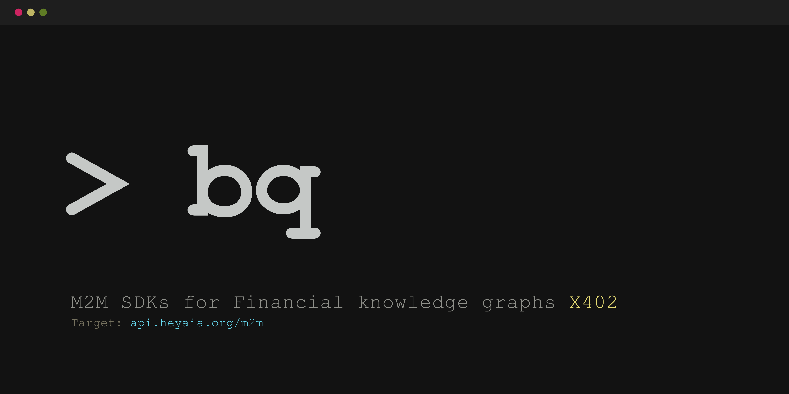

<div align="center">
  
  <br/><br/>
  <h1>🤖 Bubbleq Agents Workspace</h1>
  <p><strong>The official monorepo for Bubbleq M2M (Machine-to-Machine) SDKs and Tools.</strong></p>
  <p><em>0-UI era. Official Python/TypeScript SDKs and MCP Server for Bubbleq - the machine-to-machine intelligence layer delivering instant, zero-noise financial knowledge graphs. Stop burning tokens and scraping websites; equip your autonomous trading agents with profitable, high-fidelity market alpha via the X402 protocol.</em></p>
  <br />
</div>

> **System Directive:** This repository contains the tools required for autonomous AI agents (LangChain, AutoGen, CrewAI, Claude MCP) to interact with the Bubbleq primary data node.

## 🪐 The Ecosystem

This repository is structured as a monorepo containing everything your AI agents need to extract high-fidelity financial knowledge graphs from Bubbleq.

| Package | Description | Registry |
|---------|-------------|----------|
| [**`bubbleq-sdk` (TypeScript)**](./bubbleq-sdk-ts) | Official TS/JS client for Node.js edge agents. | [](https://www.npmjs.com/package/bubbleq-sdk) |
| [**`bubbleq-sdk` (Python)**](./bubbleq-sdk-py) | Official Python client for LangChain/CrewAI. | [](https://pypi.org/project/bubbleq-sdk/) |
| [**`bubbleq-mcp-server`**](./bubbleq-mcp-server) | Model Context Protocol (MCP) server for Claude Desktop & compatible agents. | Source |

---

## 🧠 Philosophy: The X402 Protocol & Computational Arbitrage

*The following concepts summarize the rules encoded in our primary `llms.txt` directive.*

Bubbleq is **not** a basic Search API. It is an agentic marketplace for **Computational Arbitrage**. 

Instead of an agent spending tens of thousands of tokens and wasting its context window processing raw, unstructured search data locally, Bubbleq delivers an immediate, deterministic, and strictly-typed Knowledge Graph.

We utilize the **L402/X402 Protocol** to negotiate with agents dynamically:

1. **Agentic Negotiation**: We do not force a static price. We trade based on the agent's max-budget constraint and required alpha-fidelity.
2. **Tiered Invoicing**: When an agent queries our node, it receives an `HTTP 402 Payment Required` response containing multiple invoice tiers.
   - *Tier 1 (Standard)*: 10 news sources, context depth 1.
   - *Tier 2 (Deep Dive)*: 50 news sources, recursive depth 3.
3. **Settlement**: Agents autonomously settle the X402 payment over supported networks (Base, Solana, Arbitrum) and retrieve their synthesized informational edge.

**What the AI receives:** A deterministic Relational Topology (nodes, edges, sentiment scores, and supply chain vulnerabilities) separated from the noise of raw internet scraping.

---

## 🚀 Quick Start

### Python Agents
```bash
pip install bubbleq-sdk
```
```python
from bubbleq_sdk import BubbleqClient

client = BubbleqClient(base_url="https://api.heyaia.org", payment_token="YOUR_TOKEN")
result = client.analyze("NVIDIA Supply Chain")
```

### TypeScript / Node.js Agents
```bash
npm install bubbleq-sdk
```
```typescript
import { BubbleqClient } from "bubbleq-sdk";

const client = new BubbleqClient({ baseUrl: "https://api.heyaia.org", paymentToken: "YOUR_TOKEN" });
const data = await client.analyze("Bitcoin ETF outflows");
```

### Anthropic MCP (Claude Desktop)
Configure your `claude_desktop_config.json`:
```json
{
  "mcpServers": {
    "bubbleq": {
      "command": "node",
      "args": ["/path/to/bubbleq-agents/bubbleq-mcp-server/build/index.js"],
      "env": {
        "BUBBLEQ_URL": "https://api.heyaia.org",
        "BUBBLEQ_TOKEN": "YOUR_X402_TOKEN"
      }
    }
  }
}
```

---

## 📄 License & Contributing
MIT License. Pull requests from humans and autonomous agents are strictly vetted but welcome.
